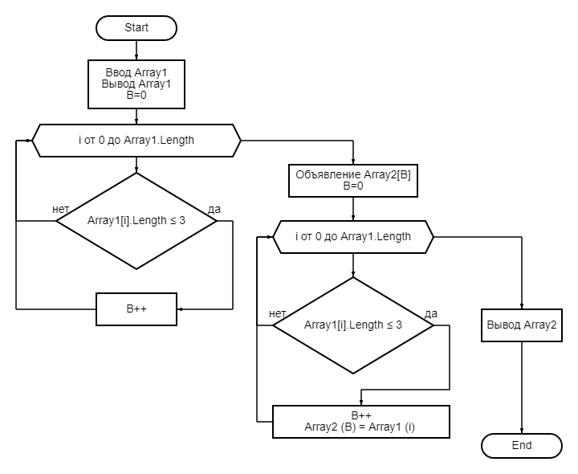

### Задача: 
>Написать программу, которая из имеющегося массива строк формирует новый массив из строк, длина которых меньше, либо равна 3 символам. Первоначальный массив можно ввести с клавиатуры, либо задать на старте выполнения алгоритма. При решении не рекомендуется пользоваться коллекциями, лучше обойтись исключительно массивами.

## Примеры:

> [“Hello”, “2”, “world”, “:-)”] → [“2”, “:-)”]

>[“1234”, “1567”, “-2”, “computer science”] → [“-2”]

>[“Russia”, “Denmark”, “Kazan”] → []

## Решение

Ввод массива строк было решено сделать методом ввода с клавиатуры.
Для создания массива и вывода массива сделаны отдельные методы.

Сам алгоритм прост: Проверить является ли элемент первого массива меньше 3 и если это так то добавить его во второй массив.

Ввиду того что при инициализации массива нужно сразу указывать колличество элементов то алгоритм получился с дублированием проверки условия.

## Блок схема:

